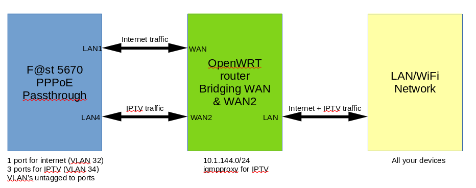

[Dual-WAN IPTV + Internet on OpenWRT Behind F@st 5670 — No Extra Cables Required.md](https://github.com/user-attachments/files/21856076/Dual-WAN.IPTV.%2B.Internet.on.OpenWRT.Behind.F%40st.5670.No.Extra.Cables.Required.md)
Want **Internet \+ IPTV** over a single OpenWRT router behind the **F@st 5670** — without running extra cables to media boxes? Here's a working **dual-WAN passthrough setup** using IGMP proxy and OpenWRT bridging.

**What You’ll Need**

* F@st 5670 modem with PPPoE passthrough mode  
* OpenWRT router with 2 WAN ports (e.g. GL.iNet Flint 3\)  
* IGMP snooping \+ IGMPproxy installed on OpenWRT

**Background**  
When you enable PPPoE passthrough mode, one of the LAN ports on the F@st 5670 modem will handle the PPPoE session and the other three will do IPTV. The technicians and helpdesk will tell you that you need to run separate cables from one of those three ports to the media boxes to get them to work. As that was something I didn’t want to do — but I did want to run my own router — I started looking for a solution and found one.

**What we are going to set up**

* Internet via PPPoE on WAN  
* IPTV via static IP on WAN2  
* IGMPproxy to forward multicast streams  
* Bridged LAN/WiFi for media boxes  
* Firewall and routing tweaks to isolate IPTV traffic

**Router Setup**  
You need a router with 2 WAN ports running OpenWRT. If your OpenWRT router has only one WAN port, you’ll need to convert one of the LAN ports into a WAN port. In my case, I used a GL.iNet Flint 3, which has 2 WAN ports by default.

**Pre-Setup: Make IPTV Work Behind Your Router**

1. Disconnect the main WAN port so it doesn’t interfere.  
2. Connect the WAN2 port (I used LAN 4 on the modem).  
3. Set it to DHCP mode.  
4. Reserve the IP for that port in the F@st DHCP server (just to be sure).  
5. Set those IP settings as static on the OpenWRT router.

**Install Required Packages**  
Open a shell, to start a SSH session to OpenWRT and run:  
*ssh root@192.168.8.1*  
*opkg update*  
*opkg install igmpproxy kmod-qca-mcs*  
Enable IGMP snooping from the Flint web interface.

**Check Network Config**  
Install nano on OpenWRT to edit the config file.  
*opkg install nano*  
*nano /etc/config/network*  
Look for igmp\_snooping and make sure it is set to 1 on:

* device ‘br\_lan’  
* interface ‘lan’  
* interface ‘guest’ (if used)

Restart the network if you changed something  
*/etc/init.d/network restart*

**Fix IGMPproxy Settings**  
If your TV freezes after 4–5 seconds, update the IGMPproxy config:  
*nano /etc/config/igmpproxy*  
Look for something like:  
*option altnet '192.168.1.0/24'*  
Change it to:  
*option altnet '10.1.144.0/24'*  
Restart the proxy and network:  
*/etc/init.d/network restart*  
*/etc/init.d/igmpproxy restart*  
If your TV still doesn’t start playing, look for:  
*option network 'wan'*  
Change it to:  
*option network 'secondwan'*  
Restart the proxy and network:  
*/etc/init.d/network restart*  
*/etc/init.d/igmpproxy restart*  
(Note: The name of the second WAN interface may differ depending on your router model.)

**Set Up PPPoE Passthrough**

1. Disconnect the WAN2 port.  
2. Connect the WAN port (I used LAN 1 on the modem).  
3. Go to your F@st modem web interface:  
* Copy the PPPoE username and password and store them safely.  
* Remove everything from the username and password boxes.  
* Press Apply.  
* Enable PPPoE passthrough and press Apply again.  
* Disable the DHCP server.  
* Disable all the other services and press apply on every page where you disabled something.  
1. In the Flint web interface:  
* Set the WAN port to PPPoE.  
* Enter the username and password.  
* No need to set anything else — OpenWRT will figure it out.

Your router should now connect and serve the home.

**Putting It Together**  
Connect both WAN ports to the modem:

* WAN → LAN1 on the modem  
* WAN2 → LAN4 on the modem

If the TV's stop working and you had to change 'wan' to 'secondwan' in the igmpproxy config file, change it back to wan and restart the proxy.

**Cleaning up**  
We now have to remove the dead end gateway on WAN2, as this device has no internet access. open the network config.  
*nano /etc/config/network*  
Remove the next line from interface ‘secondwan’.  
*option gateway '192.168.1.1'*  
Restart the network.  
*/etc/init.d/network restart*  
Check if there is only 1 gateway active. You should just see the pppoe-wan gateway here.  
*ip route show table main | grep default*  
As there is no internet available on this interface we should stop multiwan from using it as a failback. This prevents OpenWRT from mistakenly using the IPTV interface as a backup internet route, which would break internet and cause DNS issues. (This can be mwan3 on your device.)  
*nano /etc/config/kmwan*  
Look for  
*config member 'secondwan'*  
And set disabled to 1  
*option disabled '1*'  
Now we isolate the vlan’s. Open the network config and look for.  
*config device*  
        *option name 'eth1.2'*  
        *option type '8021q'*  
Add the next line to attach it to vlan 2\.  
       *option vid '2'*  
Now we build the switch and isolate IPTV.  
*config switch*  
        *option name 'switch1'*  
        *option reset '1'*  
        *option enable\_vlan '1'*

*config switch\_vlan 'vlan\_lan'*  
        *option device 'switch1'*  
        *option vlan '1'*  
        *option ports '3t 4 5 6 7' \# 7 is iptv*

*config switch\_vlan 'vlan\_iptv'*  
        *option device 'switch1'*  
        *option vlan '2'*  
        *option ports '3t'*  
Restart the network.  
*/etc/init.d/network restart*

**Summary**

* WAN serves Internet via the bridge to LAN/WiFi.  
* secondWAN serves IPTV via the same bridge to LAN/WiFi.  
* OpenWRT bridges everything together into one network — no need for extra cables.
